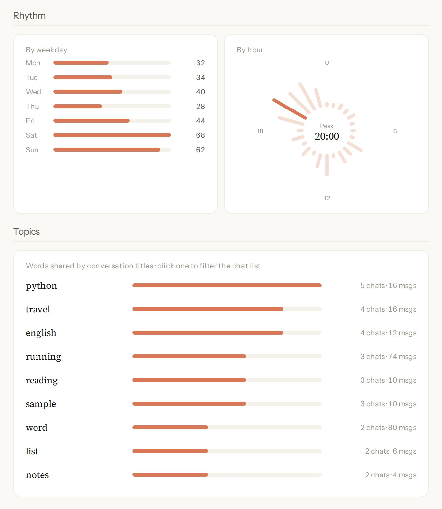

# Chat Archive Viewer

A local-only viewer and analytics dashboard for Claude conversation exports. Load the `conversations.json` file exported from Claude to read your chats in a clean interface and see how you use AI over time: when you talk to it, how the conversation is shared between you and the model, and what you talk about. Everything is processed in your browser; nothing is uploaded anywhere.

[Live demo →](https://qithyang.github.io/chat-archive-viewer/) · [中文说明](#中文说明)


*Screenshots show the bundled sample data, not real conversations. The interface is in English or Chinese (switch with the 中 / EN button in the sidebar).*

## Conversation analytics

The **Stats** tab turns an export into a usage profile. It answers questions such as:

- **How much and how regularly?** Conversations, messages, active days, the longest streak of consecutive days, and a daily heatmap.
- **When?** Messages by weekday and by hour, and how many conversations happen late at night.
- **Who does the talking?** Each side's share of the characters written, and characters per month for both.
- **About what?** Topics from conversation titles, the longest conversations, the late-night ones, the most frequent words on each side, and the most-used emoji.



### Metric definitions

| Metric | Definition |
|---|---|
| Conversations, messages | Conversations in the list (deleted ones excluded) and their visible messages. A message counts if it shows something: text, thinking, files or tool activity. |
| Time span, active days | Calendar days from the first to the last message (inclusive), and days with at least one message. |
| Longest streak | The longest run of consecutive active days. |
| Late-night chats | Conversations with at least one message between 02:00 and 04:59. |
| Character share | Characters of message text per side, whitespace excluded. Thinking, tool calls and attachment contents are not counted. |
| Daily heatmap | Messages per day for up to the last 53 weeks; the four colour levels split the non-zero days at their quartiles, so the scale adapts to light and heavy users alike. |
| Rhythm | Messages by weekday (Monday first) and by hour of the day. |
| Longest conversations | Ranked by visible messages, ties broken by characters. |
| Title topics | Words from conversation titles, segmented like Top words. Each word counts once per conversation; words found in only one conversation are dropped. Ranked by conversations, then by the visible messages in them. Clicking a topic filters the conversation list by title. |
| Top words | Words from each side's text, segmented with `Intl.Segmenter` (handles Chinese and English); code blocks, inline code and links removed, case folded; very short words (one Chinese character, or one or two Latin letters), common stopwords and words seen only once are dropped. |
| Most-used emoji | Counted as whole grapheme clusters, so a combined emoji such as 👨‍💻 counts once; text symbols such as © are excluded. |

### How it is computed

- **Local time throughout.** Days, hours and weekdays use the browser's time zone, so the numbers match what the timeline shows.
- **Separated from the UI.** One pure function takes the conversation list and returns every figure; the charts only draw its output. The result is cached until the data changes (import, merge or delete).
- **Tested on edge cases.** `node --test` runs the computation on small hand-made inputs with known answers: streaks across a month boundary, the 01:59 / 02:00 cut-off, whitespace and code points in character counts, combined emoji, stopwords and code in word counts, title topics in mixed Chinese and English, heatmap quartile cuts, the 00:00 / 23:59 hour buckets, and messages or conversations with nothing visible.
- **No dependencies.** Charts are inline SVG drawn with the page's own colours and fonts; nothing is fetched from a CDN.

## Viewer features


- **Conversation list**: sorted by last update, with title search and delete (local soft delete)
- **Message rendering**: Markdown (bold, italic, lists, code blocks, quotes, links), attachments, image placeholders
- **Thinking chains**: a collapsible pill button that expands into a block marked by a left rule
- **Bookmarks**: hover a message to reveal ☆ and bookmark it; the Bookmarks tab groups them by conversation
- **Timeline**: month calendar view with conversation days highlighted
- **Two languages**: English and Chinese interface, each with its own sample data
- **Search**: current conversation or all conversations, with highlighting and next/previous jumps
- **Merge multiple imports**: the sidebar `+` button imports another export, de-duplicated by conversation uuid
- **Export**: back up your data as JSON, or export a self-contained HTML file that opens on its own

## Usage

### Online (recommended)

Open <https://qithyang.github.io/chat-archive-viewer/>

- With no data loaded, sample conversations are shown
- To view your own data, drag the `conversations.json` exported from Claude onto the upload box

### Local

```bash
git clone https://github.com/QithYang/chat-archive-viewer.git
cd chat-archive-viewer
python -m http.server 8765
```

Then open `http://localhost:8765/` in your browser.

## Data and privacy

Imported conversations are stored in your browser (IndexedDB). The page makes no network requests with your data; it only loads its own local files.

## Tech

A single-file front end (HTML + CSS + JavaScript) with no framework and no build step.

## Project structure

```
.
├── index.html               # the whole app (HTML + CSS + JS in one file)
├── assets/                  # icon and screenshots
├── fonts/                   # bundled fonts; licenses in fonts/licenses/
├── demo-conversations*.json # sample data, English and Chinese (generated by scripts/gen-demo.py)
├── scripts/                 # demo data generator
├── tests/                   # stats tests (node --test)
├── LICENSE
└── .gitignore
```

## How it was built

Built with AI coding agents. I specified the features and the privacy model (fully client-side; no data leaves the browser) and verified the behaviour through browser testing.

## License

The code is released under the [MIT License](LICENSE).

The bundled fonts are under the SIL Open Font License; see [fonts/licenses/](fonts/licenses/).

---

## 中文说明

本地运行的 Claude 对话查看器与数据分析面板。载入 Claude 导出的 `conversations.json`，既能在清爽的界面里回看对话，也能看到自己使用 AI 的规律：什么时候聊、双方各说了多少、都聊些什么。所有数据在浏览器本地处理，不上传任何东西。

[在线体验 →](https://qithyang.github.io/chat-archive-viewer/)


### 对话数据分析

「统计」页把一份导出变成一份使用画像，回答这些问题：

- **用得多不多、规律不规律？** 对话数、消息数、活跃天数、最长连续天数、每日热力图。
- **什么时候用？** 按星期、按小时的消息分布，以及深夜对话有多少。
- **谁说得多？** 双方字数占比，以及双方每月字数走势。
- **聊些什么？** 标题话题、最长的对话、深夜对话榜、双方高频词、常用 Emoji。


#### 指标口径

| 指标 | 定义 |
|---|---|
| 对话数、消息数 | 列表中的对话（已删除的不算）及其可见消息。有文字、思考、文件或工具调用内容的消息才算可见。 |
| 时间跨度、活跃天数 | 首条到末条消息的天数（含两端），以及至少有 1 条消息的天数。 |
| 最长连续 | 连续活跃天数的最大值。 |
| 深夜对话 | 至少有 1 条消息落在 02:00–04:59 的对话数。 |
| 字数占比 | 双方正文的字符数，不含空白；思考、工具调用、附件内容不计。 |
| 每日热力图 | 最近至多 53 周每天的消息数；颜色四档按非零日的四分位数切分，用得多和用得少的人都能看出层次。 |
| 节奏 | 按星期（周一在前）和按小时的消息数。 |
| 最长对话 | 按可见消息数排序，相同时比字数。 |
| 标题话题 | 对话标题分词，规则同高频词；一个词在一个对话里只算一次；只在一个对话里出现的词去掉；按对话数排序，同分看这些对话的可见消息数；点击话题按标题筛选对话列表。 |
| 高频词 | 用 `Intl.Segmenter` 分词（中英文都支持），去掉代码块、行内代码和链接，统一小写；过滤过短的词（中文单字、1–2 个字母的英文）、常见停用词和只出现一次的词。 |
| 常用 Emoji | 按完整字形计数，👨‍💻 这类组合 emoji 算 1 个；©、® 等文本符号不计。 |

#### 计算方式

- **统一本地时区**：日期、小时、星期都按浏览器时区计算，和时间轴显示一致。
- **计算与界面分离**：一个纯函数接收对话列表、返回全部数值，图表只负责绘制；结果缓存到数据变化（导入、合并、删除）时才重算。
- **边界情况有测试**：`node --test` 用预先算好答案的小样例验证跨月连续天数、01:59/02:00 分界、字数的空白与码点、组合 emoji、高频词的停用词与代码过滤、中英混排的标题话题、热力图的四分位切分、00:00/23:59 的小时归档、没有可见内容的消息和对话。
- **零依赖**：图表是内联 SVG，沿用页面自己的配色和字体，不从 CDN 加载任何东西。

### 查看器功能


- **对话列表** — 按最近更新排序，支持标题搜索、删除（本地软删除）
- **消息渲染** — Markdown（加粗/斜体/列表/代码块/引用/链接）、附件、图片占位
- **思考链** — 药丸折叠按钮 + 左侧竖线展开块
- **收藏** — hover 消息显示 ☆，点击收藏。「收藏」标签页按对话分组浏览
- **时间轴** — 月历视图，有对话的日期高亮
- **中英双语** — 侧边栏「中 / EN」按钮切换界面语言，示例数据也随之切换
- **搜索** — 当前对话 / 全部对话两种范围，支持高亮、上下跳转
- **多次导入合并** — 侧边栏 `+` 按钮，按 uuid 去重
- **导出** — 导出 JSON 备份，或导出可单独打开的独立 HTML 文件

### 使用

#### 在线（推荐）

打开 <https://qithyang.github.io/chat-archive-viewer/>

- 没有数据时会展示示例对话
- 想看自己的数据：把从 Claude 导出的 `conversations.json` 拖进上传框

#### 本地

```bash
git clone https://github.com/QithYang/chat-archive-viewer.git
cd chat-archive-viewer
python -m http.server 8765
```

浏览器访问 `http://localhost:8765/`。

### 数据与隐私

导入的对话保存在浏览器本地（IndexedDB）。页面不会把你的数据发往任何服务器，只加载自身的本地文件。

### 文件结构

```
.
├── index.html               # 整个应用（HTML + CSS + JS 单文件）
├── assets/                  # 图标与截图
├── fonts/                   # 内置字体，许可证在 fonts/licenses/
├── demo-conversations*.json # 演示数据，英文与中文各一份（由 scripts/gen-demo.py 生成）
├── scripts/                 # 演示数据生成脚本
├── tests/                   # 统计测试（node --test）
├── LICENSE
└── .gitignore
```

### 开发方式

借助 AI 编程工具完成：功能与隐私模型（完全在浏览器本地运行，数据不外传）由我定义，行为经我在浏览器中测试验证。

### 许可证

代码采用 [MIT 许可证](LICENSE)。

内置字体采用 SIL Open Font License，许可证见 [fonts/licenses/](fonts/licenses/)。
