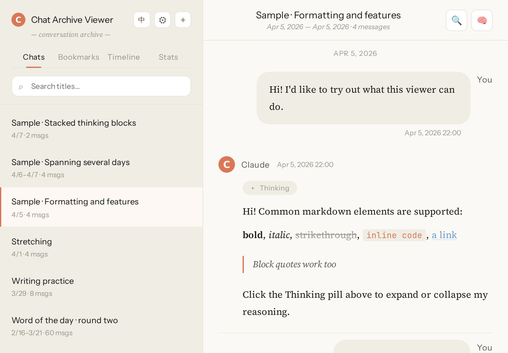
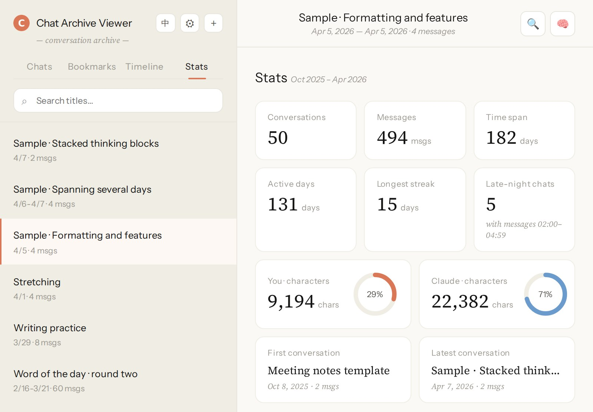

# Chat Archive Viewer

A lightweight, local-only viewer for Claude conversation exports. It renders the `conversations.json` file exported from Claude as a clean chat interface. Everything is processed in your browser; nothing is uploaded anywhere.

[Live demo →](https://qithyang.github.io/chat-archive-viewer/) · [中文说明](#中文说明)



*The interface is in English or Chinese (switch with the 中 / EN button in the sidebar). Screenshots show the bundled sample data, not real conversations.*



## Features

- **Conversation list**: sorted by last update, with title search and delete (local soft delete)
- **Message rendering**: Markdown (bold, italic, lists, code blocks, quotes, links), attachments, image placeholders
- **Thinking chains**: a collapsible pill button that expands into a block marked by a left rule
- **Bookmarks**: hover a message to reveal ☆ and bookmark it; the Bookmarks tab groups them by conversation
- **Timeline**: month calendar view with conversation days highlighted
- **Statistics**: totals, activity streaks, a daily heatmap, weekday and hour-of-day rhythm, monthly character counts, longest and late-night conversations, top words for each side, and most-used emoji
- **Two languages**: English and Chinese interface, each with its own sample data
- **Search**: current conversation or all conversations, with highlighting and next/previous jumps
- **Merge multiple imports**: the sidebar `+` button imports another export, de-duplicated by conversation uuid
- **Export**: back up your data as JSON, or export a self-contained HTML file that opens on its own

## Usage

### Online (recommended)

Open <https://qithyang.github.io/chat-archive-viewer/>

- With no data loaded, sample conversations are shown
- To view your own data, drag the `conversations.json` exported from Claude onto the upload box

### Local

```bash
git clone https://github.com/QithYang/chat-archive-viewer.git
cd chat-archive-viewer
python -m http.server 8765
```

Then open `http://localhost:8765/` in your browser.

## Data and privacy

Imported conversations are stored in your browser (IndexedDB). The page makes no network requests with your data; it only loads its own local files.

## Tech

A single-file front end (HTML + CSS + JavaScript) with no framework and no build step.

## Project structure

```
.
├── index.html               # the whole app (HTML + CSS + JS in one file)
├── assets/                  # icon and screenshot
├── fonts/                   # bundled fonts; licenses in fonts/licenses/
├── demo-conversations*.json # sample data, English and Chinese (generated by scripts/gen-demo.py)
├── scripts/                 # demo data generator
├── tests/                   # stats tests (node --test tests/)
├── LICENSE
└── .gitignore
```

## How it was built

Built with AI coding tools. I specified the features and the privacy model (fully client-side; no data leaves the browser) and verified the behaviour through browser testing.

## License

The code is released under the [MIT License](LICENSE).

The bundled fonts are licensed under the [SIL Open Font License 1.1](https://openfontlicense.org), not MIT:

- [Source Serif 4](https://github.com/adobe-fonts/source-serif) ([license](fonts/licenses/SourceSerif4-OFL.txt))
- [Instrument Sans](https://github.com/Instrument/instrument-sans) ([license](fonts/licenses/InstrumentSans-OFL.txt))
- [JetBrains Mono](https://github.com/JetBrains/JetBrainsMono) ([license](fonts/licenses/JetBrainsMono-OFL.txt))

---

## 中文说明

轻量、本地的 Claude 对话查看器 —— 把 Claude 导出的 `conversations.json` 渲染成清晰的聊天界面。所有数据在浏览器本地处理，不上传任何东西。

[在线体验 →](https://qithyang.github.io/chat-archive-viewer/)


### 功能

- **对话列表** — 按最近更新排序，支持标题搜索、删除（本地软删除）
- **消息渲染** — Markdown（加粗/斜体/列表/代码块/引用/链接）、附件、图片占位
- **思考链** — 药丸折叠按钮 + 左侧竖线展开块
- **收藏** — hover 消息显示 ☆，点击收藏。「收藏」标签页按对话分组浏览
- **时间轴** — 月历视图，有对话的日期高亮
- **统计** — 总量与连续天数、每日热力图、星期/24 小时分布、每月字数、最长与深夜对话榜、双方高频词、常用 Emoji
- **中英双语** — 侧边栏「中 / EN」按钮切换界面语言，示例数据也随之切换
- **搜索** — 当前对话 / 全部对话两种范围，支持高亮、上下跳转
- **多次导入合并** — 侧边栏 `+` 按钮，按 uuid 去重
- **导出** — 导出 JSON 备份，或导出可单独打开的独立 HTML 文件

### 使用

#### 在线（推荐）

打开 <https://qithyang.github.io/chat-archive-viewer/>

- 没有数据时会展示示例对话
- 想看自己的数据：把从 Claude 导出的 `conversations.json` 拖进上传框

#### 本地

```bash
git clone https://github.com/QithYang/chat-archive-viewer.git
cd chat-archive-viewer
python -m http.server 8765
```

浏览器访问 `http://localhost:8765/`。

### 数据与隐私

导入的对话保存在浏览器本地（IndexedDB）。页面不会把你的数据发往任何服务器，只加载自身的本地文件。

### 文件结构

```
.
├── index.html               # 整个应用（HTML + CSS + JS 单文件）
├── assets/                  # 图标与截图
├── fonts/                   # 内置字体，许可证在 fonts/licenses/
├── demo-conversations*.json # 演示数据，英文与中文各一份（由 scripts/gen-demo.py 生成）
├── scripts/                 # 演示数据生成脚本
├── tests/                   # 统计测试（node --test tests/）
├── LICENSE
└── .gitignore
```

### 开发方式

借助 AI 编程工具完成：功能与隐私模型（完全在浏览器本地运行，数据不外传）由我定义，行为经我在浏览器中测试验证。

### 许可证

代码采用 [MIT 许可证](LICENSE)。

内置字体采用 [SIL Open Font License 1.1](https://openfontlicense.org)，不属于 MIT：Source Serif 4、Instrument Sans、JetBrains Mono，许可证全文见 `fonts/licenses/`。
